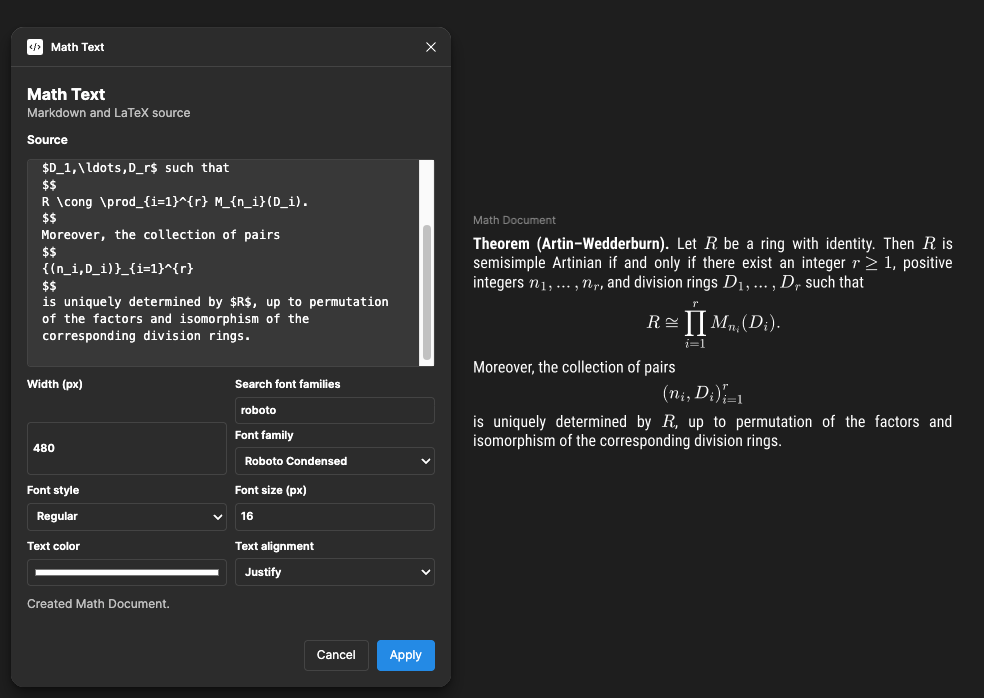

# Math Text: Native Markdown and LaTeX Typesetting for Figma


**Community plugin:** [Math Text on Figma Community](https://www.figma.com/community/plugin/1673896435619981207)

Math Text is a local-first Figma plugin for typesetting Markdown prose and LaTeX mathematics as one visually coherent document. Prose remains editable as native Figma text, while each delimited mathematical expression is rendered as one atomic MathJax SVG with expression-specific metrics.

The plugin preserves the canonical Markdown/LaTeX source with the generated document. This supports later editing and deterministic reflow without a backend, CDN, or remote font request.



_Figure 1. Math Text rendering an academic theorem with native Roboto Condensed prose, atomic LaTeX vectors, and justified alignment._

---

## Features

- Native Figma `TextNode` prose with selected family, style, size, color, and width.
- Local MathJax rendering for inline `$...$` and display `$$...$$` expressions.
- Atomic SVG math with expression-specific ascent, descent, and baseline placement.
- Markdown source editing with CodeMirror.
- Left, center, right, and justified paragraph alignment.
- Font-family search using fonts returned by Figma.
- Transactional replacement and versioned source persistence.
- Editing through the **Edit Math Text** relaunch action on generated documents.
- Offline operation with no backend or remote asset requests.

---

## Setup

Install dependencies and produce the self-contained plugin bundle:

```bash
pnpm install --frozen-lockfile
pnpm build
```

The production build creates exactly:

```text
dist/code.js
dist/ui.html
```

In Figma, open **Plugins → Development → Import plugin from manifest…** and select this repository's `manifest.json`. After rebuilding, reload the development plugin in Figma.

---

## Usage

Run **Math Text** in Figma. Enter Markdown with inline or display LaTeX:

```md
**Theorem (Artin–Wedderburn).** Let $R$ be a semisimple Artinian ring.

$$
R \cong \prod_{i=1}^{r} M_{n_i}(D_i).
$$
```

Configure the document width, Figma font family and style, font size, text color, and alignment. Then select **Apply**.

To edit an existing result, select the generated Math Text document and use its **Edit Math Text** relaunch action. The plugin restores the canonical source and saved settings. Applying changed source, width, or typography performs a complete measured reflow.

---

## Design

The renderer uses a strict source boundary:

```text
Markdown prose  → native Figma TextNode
Delimited LaTeX → local MathJax → one atomic SVG
```

Line composition uses Figma-measured text advances and MathJax-provided math metrics. Final positions are reconciled against actual native node widths. Justification expands only eligible source whitespace; it does not stretch glyphs or mathematical geometry.

See [`docs/ARCHITECTURE.md`](docs/ARCHITECTURE.md) for the full design and [`docs/LAYOUT.md`](docs/LAYOUT.md) for measurement, baseline, and alignment details.

---

## Development

Run all automated checks before importing a release build:

```bash
pnpm format:check
pnpm lint
pnpm typecheck
pnpm test
pnpm build
pnpm smoke:controller
```

The controller smoke test executes `dist/code.js` without a DOM. `pnpm build` also runs a production size gate: `dist/` must contain exactly `code.js` and `ui.html`, `code.js` must stay below 1 MB, and their total must stay below 15,000,000 bytes.

Figma injects the special controller global `__html__` from the manifest's `ui` entry at runtime. The production controller deliberately does not embed `ui.html`; running `dist/code.js` outside Figma therefore requires a test harness to provide a nonempty `__html__` value. Manual Figma checks remain necessary because mocked APIs cannot fully reproduce native font geometry and SVG import behavior. See [`docs/visual-qa-fixture.md`](docs/visual-qa-fixture.md) for the release checklist.
